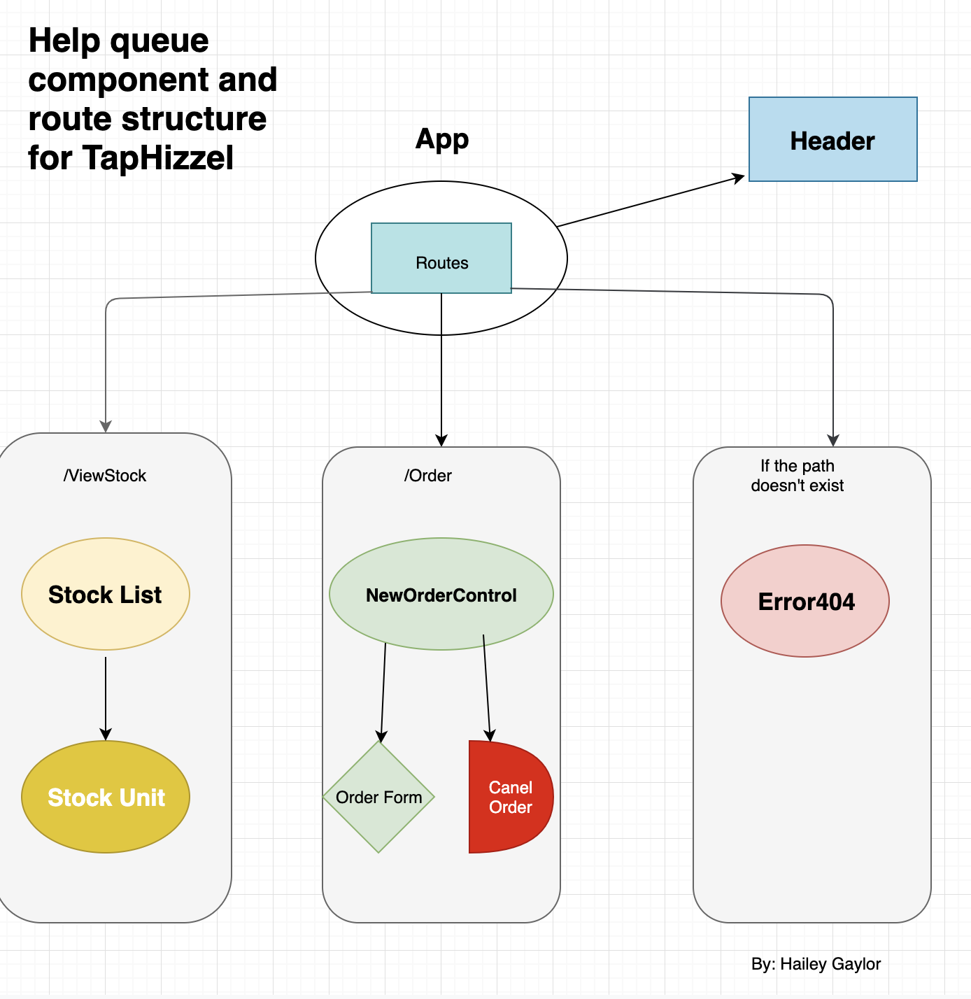

# _TapHizzle_

#### _Application to track TapHizzels beverages on tap, November 2019_

#### By _**Hailey Gaylor**_
### Flow Chart

## Description

_This application was built and designed as a convientant tracking system for vendors around. The functionality of this will allow staff memebers to add and edit a beverage of choice and allow the user to update the status of the beverage through out the day. This application will track and save the data through out the use of the stock to better help calculate production and cost for better forcasting._

## Setup/Installation Requirements

- Open the terminal and navigate to the desktop.
- Run the command $ git clone https://github.com/Hgaylor0220/TapHIzzel.git.
- Navigate into the project folder and run the command $ npm init
- in the command line run $ npm i . This will install required packages.
- In the command line $ npm run start to view the project. 

## Using a debugger
- Debuggers are all set up for this project. If you would like to add addition code to this project using the linter run the command $ eslint -- init. 
- to set the linter configurations follow these steps:
- ? Are you using ECMAScript 6 features? Yes
- ? Are you using ES6 modules? Yes
- ? Where will your code run? Browser
- ? Do you use CommonJS? No
- ? Do you use JSX? Yes
- ? Do you use React? Yes
- ? What style of indentation do you use? Spaces  
- ? What quotes do you use for strings? Single
- ? What line endings do you use? Unix (select windows if you are a window user)
- ? Do you require semicolons? Yes
- ? What format do you want your config file to be in? JSON
- To fix linter errors run the command 

- once youve completed these steps your linter is all configured. 
- to fix linter errors run the command $ eslint --fix. You can target a folder if you wish by $ eslint src/** src/**/** --fix

## Known Bugs

_None_

## Support and contact details

_For questions, comments, and feedback, please visit haileygaylor.com and contact me._

## Technologies Used

_CSS,React, Javascript, NPM packaged, Webpack, Babel, Eslint._ 

### License

*Open source*

Copyright (c) 2019 **_Hailey Gaylor_**